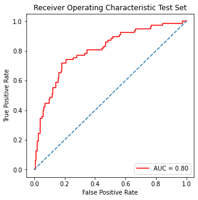
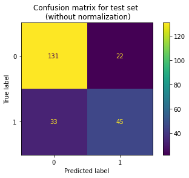
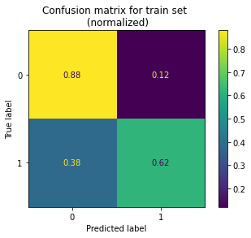
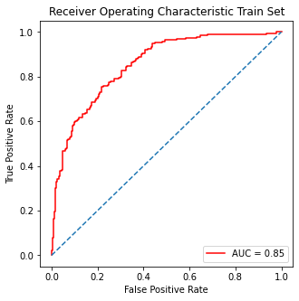

# Classification Part 2: Metrics

By Joe Ganser

* <a href="https://github.com/JoeGanser/teaching/blob/main/Lectures/supervised_learning/Classification_part2.ipynb">Github Repo</a>

### Example 1: Confusion Matrics & Classification Report

Working with confusion matrices, classification_report, loss functions and cross entropy

Suppose our observations are;

`predicted_probabilies = np.array([[0.25,0.75],[0.05,0.95],[0.25,0.75],[0.15,0.85]])`

`predictions = np.array([0,0,0,0])`

`observations = np.array([1,0,0,0])`

* Put these into a confusion matrix and classification report
* Put these into the log loss function


```python
import numpy as np
predicted_probabilies = np.array([[0.25,0.75],[0.05,0.95],[0.25,0.75],[0.15,0.85]])
predictions = np.array([0,0,0,0])
observations = np.array([1,0,0,0])

from sklearn.metrics import confusion_matrix,classification_report


print(classification_report(predictions,observations))
tn, fp, fn, tp = confusion_matrix(predictions,observations).ravel()
print(tn,fp,fn,tp)
```
                  precision    recall  f1-score   support
    
               0       1.00      0.75      0.86         4
               1       0.00      0.00      0.00         0
    
        accuracy                           0.75         4
       macro avg       0.50      0.38      0.43         4
    weighted avg       1.00      0.75      0.86         4
    
    3 1 0 0


**Print the confusion matrix**

```python
from sklearn.metrics import confusion_matrix
print(confusion_matrix(predictions,observations))
```

    [[3 1]
     [0 0]]


**Use the confusion matrix to print the count of the true negatives, false positives, false negatives and true positives** 


```python
tn, fp, fn, tp = confusion_matrix(predictions,observations).ravel()
print(tn,fp,fn,tp)
```

    3 1 0 0


**Print the classification report**


```python
from sklearn.metrics import classification_report
print(classification_report(predictions,observations))
```

                  precision    recall  f1-score   support
    
               0       1.00      0.75      0.86         4
               1       0.00      0.00      0.00         0
    
        accuracy                           0.75         4
       macro avg       0.50      0.38      0.43         4
    weighted avg       1.00      0.75      0.86         4
    


**Print the log loss**


```python
from sklearn.metrics import log_loss
log_loss(observations,predicted_probabilies)
```


    1.6417071730028858


### Example 2: Grid Search with imbalanced classes

**Using grid search CV to fit logistic regression for imbalanced classes**

* Print the first 5 rows of the data set
* Print the percentage break down of each class in the dataset
    * Do the grid search on a `train` set
    * Evaluate best model on a `test` set
* Grid search through a range of hyper parameters to find the best ones that maximize the `F1_score` metric
    * `parameters=[0.0001,0.001,0.01,0.1,1,10,100]`
* Print the `best_score_` and `best_params_` attribute of `GridSearchCV`

* Dataset link: https://raw.githubusercontent.com/JoeGanser/Datasets-1/master/pima-indians-diabetes.csv
* columns = `['times pregnant','glucose_concentration','blood-pressure','skinfold-thickness','serum-insulin','BMI','diabetes-function','age','class']`


```python
columns = ['times pregnant','glucose_concentration','blood-pressure','skinfold-thickness',
           'serum-insulin','BMI','diabetes-function','age','class']
data1 = pd.read_csv('https://raw.githubusercontent.com/JoeGanser/Datasets-1/master/pima-indians-diabetes.csv',names=columns)
X = data1.drop('class',axis=1)
y = data1['class']
print(data1.shape)
data1.head()
```

    (768, 9)


| times pregnant | glucose_concentration | blood-pressure | skinfold-thickness | serum-insulin | BMI | diabetes-function | age   | class |
|----------------|-----------------------|----------------|--------------------|---------------|-----|-------------------|-------|-------|
| 6                     | 148            | 72                 | 35            | 0   | 33.6              | 0.627 | 50    | 1 |
| 1                     | 85             | 66                 | 29            | 0   | 26.6              | 0.351 | 31    | 0 |
| 8                     | 183            | 64                 | 0             | 0   | 23.3              | 0.672 | 32    | 1 |
| 1                     | 89             | 66                 | 23            | 94  | 28.1              | 0.167 | 21    | 0 |
| 0                     | 137            | 40                 | 35            | 168 | 43.1              | 2.288 | 33    | 1 |


```python
100*data1['class'].value_counts()/len(data1)
```
    0    65.104167
    1    34.895833
    Name: class, dtype: float64


```python
from sklearn.linear_model import LogisticRegression
from sklearn.metrics import make_scorer,f1_score
from sklearn.model_selection import GridSearchCV
logreg = LogisticRegression()

parameters=[0.0001,0.001,0.01,0.1,1,10,100]
parameters = {'C':parameters}
f1 = make_scorer(f1_score, greater_is_better=True)
gs = GridSearchCV(logreg, parameters,scoring=f1)
gs.fit(X, y)
print(gs.best_score_)
print(gs.best_params_)
```

    0.6383289882125565
    {'C': 10}


### Example 3: Making a classification model report

Using the model from example 2, split the data set from example 2 into a train and test set. Using the best parameters from the `GridSearchCV`, generate the following metrics (for both the train set and test set!)
* Classification report
* f1 score
* accuracy score
* confusion matrix graph
* roc-auc curve
* auc metric


```python
import matplotlib.pyplot as plt
from sklearn.model_selection import train_test_split
from sklearn.metrics import confusion_matrix,classification_report,accuracy_score,f1_score,roc_curve,auc
X = data1.drop('class',axis=1)
y = data1['class']
X_train,X_test,y_train,y_test = train_test_split(X,y,test_size=0.3)

logreg = LogisticRegression(C=10)
logreg.fit(X_train,y_train)

y_pred_test = logreg.predict(X_test)
y_pred_prob_test = logreg.predict_proba(X_test)

y_pred_train = logreg.predict(X_train)
y_pred_prob_train = logreg.predict_proba(X_train)
```

**Classification Reports**


```python
print('Classification report train set \n ')
print(classification_report(y_pred_train,y_train))

print('Classification report test set \n ')
print(classification_report(y_pred_test,y_test))
```

    Classification report train set 
     
                  precision    recall  f1-score   support
    
               0       0.88      0.81      0.84       378
               1       0.62      0.74      0.67       159
    
        accuracy                           0.79       537
       macro avg       0.75      0.77      0.76       537
    weighted avg       0.80      0.79      0.79       537
    
    Classification report test set 
     
                  precision    recall  f1-score   support
    
               0       0.86      0.80      0.83       164
               1       0.58      0.67      0.62        67
    
        accuracy                           0.76       231
       macro avg       0.72      0.74      0.72       231
    weighted avg       0.78      0.76      0.77       231
    


**Accuracy Score**


```python
print('Accuracy score train set \n ')
print(accuracy_score(y_pred_train,y_train))

print('Accuracy Score test set \n ')
print(accuracy_score(y_pred_test,y_test))
```

    Accuracy score train set 
     
    0.7858472998137802
    Accuracy Score test set 
     
    0.7619047619047619


### Example 4: ROC-AUC plots
**ROC-AUC plot for train and test sets**


```python
y_pred_prob_test = y_pred_prob_test[:,1]
false_positive_rate_test, true_positive_rate_test, thresholds = roc_curve(y_test, y_pred_prob_test)
roc_auc_test = auc(false_positive_rate_test, true_positive_rate_test)
plt.figure(figsize=(5,5))
plt.title('Receiver Operating Characteristic Test Set')
plt.plot(false_positive_rate_test,true_positive_rate_test, color='red',label = 'AUC = %0.2f' % roc_auc_test)
plt.legend(loc = 'lower right')
plt.plot([0, 1], [0, 1],linestyle='--')
plt.axis('tight')
plt.ylabel('True Positive Rate')
plt.xlabel('False Positive Rate')
plt.show()
```


    

    


**ROC-AUC curve for train set, with AUC metric**


```python
y_pred_prob_train = y_pred_prob_train[:,1]
false_positive_rate_train, true_positive_rate_train, thresholds = roc_curve(y_train, y_pred_prob_train)
roc_auc_train = auc(false_positive_rate_train, true_positive_rate_train)
plt.figure(figsize=(5,5))
plt.title('Receiver Operating Characteristic Train Set')
plt.plot(false_positive_rate_train,true_positive_rate_train, color='red',label = 'AUC = %0.2f' % roc_auc_train)
plt.legend(loc = 'lower right')
plt.plot([0, 1], [0, 1],linestyle='--')
plt.axis('tight')
plt.ylabel('True Positive Rate')
plt.xlabel('False Positive Rate')
plt.show()
```


    

    


### Example 5: Confusion Matrix Graphic for test set


```python
import matplotlib.pyplot as plt
from sklearn.metrics import plot_confusion_matrix
plot_confusion_matrix(logreg, X_test, y_test,normalize=None)
plt.title('Confusion matrix for test set \n (without normalization)')
plt.show()
```


    

    


**Same Plot, normalized**


```python
plot_confusion_matrix(logreg, X_train, y_train,normalize='true')  
plt.title('Confusion matrix for train set \n (normalized)')
plt.show()
```


    

    


```python
plt.figure(figsize=(5,5))
plt.title('Receiver Operating Characteristic Train Set')
plt.plot(false_positive_rate_train,true_positive_rate_train, color='red',label = 'AUC = %0.2f' % roc_auc_train)
plt.legend(loc = 'lower right')
plt.plot([0, 1], [0, 1],linestyle='--')
plt.axis('tight')
plt.ylabel('True Positive Rate')
plt.xlabel('False Positive Rate')
plot_confusion_matrix(logreg, X_train, y_train,normalize='true')  
plt.title('Confusion matrix for train set \n (normalized)')
plt.show()
```


    

    


    

    


* https://stackoverflow.com/questions/49473587/why-is-my-implementations-of-the-log-loss-or-cross-entropy-not-producing-the-s
* https://machinelearningmastery.com/cross-entropy-for-machine-learning/
* https://machinelearningmastery.com/roc-curves-and-precision-recall-curves-for-classification-in-python/
* https://machinelearningmastery.com/standard-machine-learning-datasets-for-imbalanced-classification/
* https://raw.githubusercontent.com/jbrownlee/Datasets/master/pima-indians-diabetes.names


